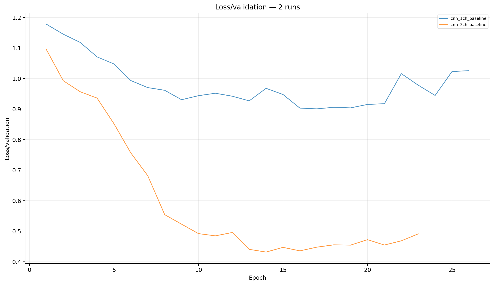
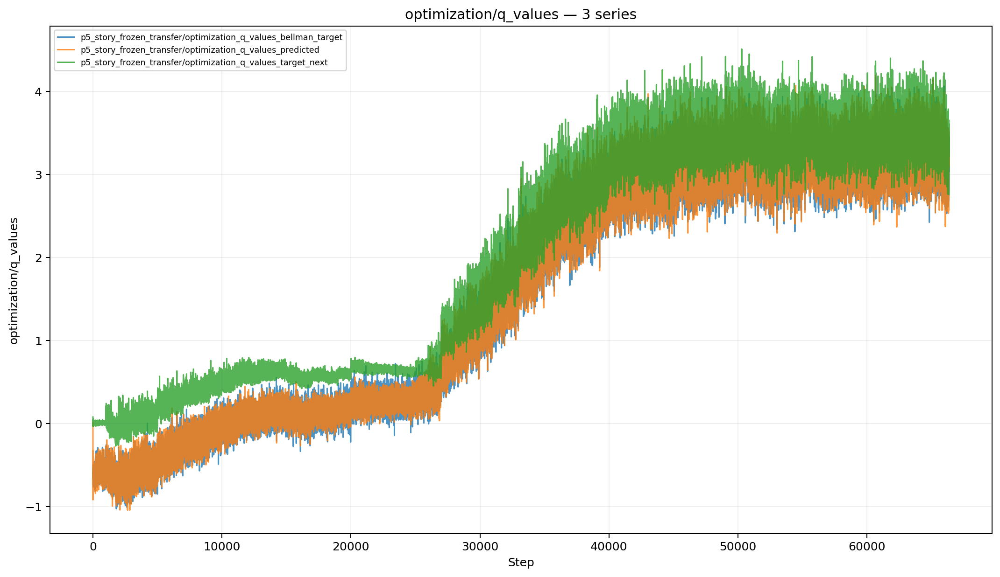
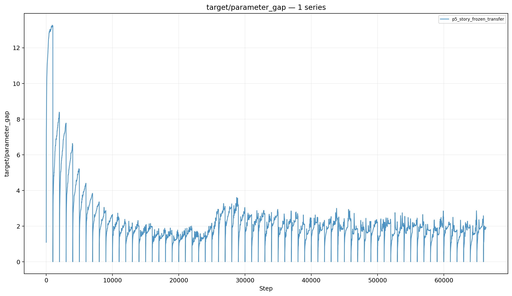

# GridWorld ML/RL Agent

GridWorld is a staged machine-learning project that follows the same navigation problem from supervised imitation into closed-loop control and reinforcement learning.

What began as an MLP → CNN → DQN progression increasingly became an evaluation project. Offline accuracy proved insufficient once a learned policy generated its own future states, deterministic policies exposed compounding errors and attractors, and reinforcement learning showed how reward design, exploration, bootstrapping, optimization, and deployment behavior can interact without producing a genuinely general navigation policy.

The final DQN-family policy is a **competent small-world controller rather than a general navigator**. That limitation is preserved rather than hidden behind stronger tooling such as action masking, memory, or explicit planning.

## Live demo

**[Open GridWorld Lab](https://snowkudu.github.io/gridworld-agent/)**

The P6 demo runs the frozen-transfer DDQN entirely in the browser through ONNX Runtime Web. Explore mode supports single policy steps, autonomous rollouts, four world tiers, and seeded random worlds. Project Story summarizes the MLP → CNN → DDQN progression beside one representative W15 replay; it does not download or execute the historical MLP and CNN models.

---

## Project story

| Phase | Question | Outcome |
|---|---|---|
| **P1** | Can the environment and dataset contract be made reproducible? | Frozen GridWorld contract, BFS oracle, dataset generation, and verification tests |
| **P2** | Can an MLP imitate the BFS expert? | Useful offline classifier, but limited policy quality |
| **P3** | Does offline classification accuracy survive closed-loop control? | Mostly no; repeated mistakes compound into softlocks and timeouts |
| **P4** | Does spatial representation improve the policy? | A 3-channel CNN substantially improves autonomous control and exposes deterministic deadlocks more clearly |
| **P5** | Can a relatively blind DQN learn robust navigation from interaction? | Strong bounded-grid competence, but a brittle long-horizon Q-policy and poor scaling to harder worlds |
| **P6** | Can the whole project be understood quickly without reading the experiment history? | Static browser demo with live ONNX inference and a compact project story |

---

## Environment

The canonical environment is a deterministic `10 × 10` GridWorld.

- `30%` obstacle density
- random agent start and goal
- BFS-solvable maps only
- actions: up, down, left, right
- illegal actions leave the agent in place
- a BFS oracle provides shortest-path labels and evaluation references
- model input can be converted to a 3-channel representation:
  - obstacles
  - agent
  - goal

The environment is intentionally simple enough that the original expectation was that a neural network should eventually learn a broadly competent navigation policy without stronger policy-side structure.

---

## P2–P4: supervised policies

P2 trained an MLP to imitate the BFS oracle. It achieved useful offline classification performance, but P3 (closed-loop evaluation) showed that offline accuracy was a weak proxy for autonomous control: once the model's own mistakes determined its next inputs, repeated deterministic errors quickly compounded.

P4 replaced the flattened representation with a spatial CNN using separate obstacle, agent, and goal channels. This produced the first large improvement in autonomous behavior.



A multi-seed finalist gauntlet was used to select the P4 CNN rather than relying on a single lucky run. The selected CNN reached approximately **70% autonomous success** on its canonical 100-world closed-loop evaluation, while its failures remained dominated by repeated-state deadlocks and short oscillations. For reference, adding a direct rescue policy could push the same evaluation to 100% success, but that did not make the underlying autonomous policy itself stronger.

The key P4 lesson was already visible:

> A model can contain useful spatial information and still fail as a robust closed-loop navigation policy.

---

## P5: reinforcement learning

### Original intention

P5 began with a simple expectation:

> Given a small, fully observed GridWorld, a DQN should eventually figure out navigation.

The agent was deliberately kept relatively blind. The Q-policy itself had to learn legality, recovery, and navigation preferences from interaction.

### What actually happened

The first useful DQN policies did not fail primarily because they lacked all spatial competence. They repeatedly collapsed into deterministic attractors, especially short reversals and two-state oscillations.

The implementation itself also evolved during the phase. The original DQN target logic was changed to **DDQN-style target selection** in an attempt to improve Q-value stability and reduce overestimation. From that point onward, the later P5 experiments were effectively DDQN-family experiments even though the phase remained framed as the DQN stage of the project.

Much of the experimentation then became an attempt to improve the conditions under which Q-learning operated:

- DDQN over DQN for Q-value stability
- reward shaping
- epsilon scheduling
- Boltzmann / ResMax exploration
- replay and batch changes
- target-network synchronization
- optimizer regularization
- CNN capacity
- an inertia prior that discouraged immediate reversals

Suppressing attractors improved deployment behavior, but it also exposed a second failure mode: illegal actions and repeated collisions became more visible once immediate reversals were strongly discouraged.

The final system became much more competent, but the harder world tiers showed that the underlying Q-policy remained **brittle and short-sighted**.

### Final world-tier comparison

The final benchmark evaluates increasingly difficult world sets using fixed 500-world tiers. Each tier enforces a minimum BFS solution length.

| Model | W0 | W5 | W10 | W15 |
|---|---:|---:|---:|---:|
| **Historical scratch DDQN champion** | **88.4%** | **84.4%** | 72.0% | 42.0% |
| **Frozen P4 CNN + DDQN head** | 87.2% | 83.6% | **72.8%** | **44.2%** |

The historical scratch champion remains the best observed original P5 checkpoint. Its checkpoint-selection process was later found to be contaminated by validation seeds overlapping the training/replay path, so it is retained as a **historical best result rather than a fully reproducible reference run**.

The historical `.pt` checkpoint is intentionally **not committed or distributed**. PyTorch checkpoint files can rely on pickle-backed deserialization, and large binary checkpoints are also poor normal Git history artifacts.

### Frozen transfer result

The strongest late P5 ablation transferred the P4 supervised CNN into the RL agent, froze:

```text
both convolutional layers
fully connected layer 1
```

and trained only a fresh Q-head.

With a much slower target synchronization interval, the frozen representation reached essentially the same world-tier ceiling as the fully trainable scratch agent.

This was one of the most important P5 results.

It showed that the CNN representation itself was **not the dominant final bottleneck**. A supervised spatial representation already contained enough useful information to support near-champion RL performance.

The Q-value traces below show the frozen-transfer head learning on top of that fixed representation. Predicted values and Bellman targets remain numerically stable while the overall value scale rises and eventually plateaus.



The target-network parameter gap shows the deliberately slower synchronization schedule directly. The online head is allowed to move away from the target between sync events, while the frozen backbone removes most representation-drift ambiguity from that comparison.



The remaining weakness was much closer to the learned Q-policy:

- action values were often weakly differentiated
- small ranking errors could produce deterministic bad actions
- one-step bootstrapping did not produce reliably strong long-horizon navigation preferences
- suppressing one failure mode could simply move failure probability somewhere else
- performance degraded sharply as required path length increased

### P5 conclusion

P5 did not produce the general navigation policy originally imagined.

It produced a competent controller for small, familiar worlds, but the policy remained brittle as path length and world hostility increased. The refusal to add stronger policy-side structure — action masking, memory/context, explicit planning, or more aggressive credit-propagation machinery — left the agent in a limited regime where local competence did not mature into general navigation.

That limitation is part of the result.

---

## Key findings

- **Offline accuracy is not closed-loop competence.** Small deterministic errors can compound once a model controls its own future state distribution.
- **Spatial representation matters.** The 3-channel CNN was a major improvement over the MLP baseline.
- **Stable optimization does not imply a good policy.** TD loss, mean Q-values, and target statistics could look healthy while action rankings remained brittle.
- **Attractor suppression is not the same as learned navigation.** Inertia was effective at stopping reversals, but it was an external action prior rather than evidence that the Q-function understood why reversing was bad.
- **Representation was less limiting than expected.** A frozen supervised CNN could support almost the same final RL performance as end-to-end training.
- **Long-horizon navigation remained the ceiling.** Success fell substantially as the minimum required solution length increased even when illegality and short cycles were relatively controlled.
- **Evaluation quality changed the conclusions.** Larger fixed world tiers and stricter validation exposed several earlier assumptions that smaller or more permissive evaluations had hidden.

---

## Repository structure

```text
agents/          DQN/DDQN agent and replay buffer
configs/         experiment and story-mode configurations
data/            dataset loading and representations
environment/     GridWorld, rewards, evaluation, and viewer code
models/          MLP/CNN architectures and checkpoint helpers
policies/        action/oracle policy helpers
training/        supervised and RL training utilities
scripts/         dataset and verification utilities
tests/           contract and regression tests
artifacts/       generated experiment outputs (mostly ignored)
```

---

## Useful commands

Generate the canonical dataset:

```powershell
python -m scripts.generate_dataset --episodes 2000 --max_steps 200 --seed 123
```

Validate it:

```powershell
python -m scripts.verify data/raw/gridworld_2000ep_200ms_123seed.npz
```

Run the curated P5 story-mode training configs:

```powershell
python -m environment.evaluate_dqn train
```

Evaluate a P5 checkpoint across the world tiers:

```powershell
python -m environment.evaluate_dqn tiers --checkpoint "path\to\checkpoint.pt"
```

Run tests:

```powershell
python -m pytest -q
```

Run Ruff:

```powershell
ruff check .
```

---

## Testing and reproducibility

The repository includes regression tests for:

- GridWorld contracts
- dataset splits and representations
- MLP/CNN behavior
- replay buffer behavior
- DQN/DDQN action selection and optimization
- target synchronization
- epsilon updates
- logging and metrics
- supervised-to-RL transfer
- frozen transfer behavior

Raw experiment outputs, large TensorBoard directories, generated datasets, and model checkpoints are not intended to live in normal Git history.

The curated story-mode configurations are the reproducible reference for the final repository. Historical best checkpoints are documented separately when their exact training trajectory cannot be reproduced cleanly.

---

## Limitations

This project should not be read as evidence of general-purpose neural navigation.

The canonical models are strongly tied to a small fixed GridWorld contract. The RL agent does not use action masking, explicit planning, memory, or a scale-independent navigation architecture. Its final performance is strongest on small worlds and degrades substantially with longer required trajectories.

The project intentionally stops at that boundary rather than continuing to add stronger algorithms until the benchmark is artificially conquered.

---

## Status

- [x] **P1** — environment and dataset contract
- [x] **P2** — supervised MLP baseline
- [x] **P3** — closed-loop evaluation
- [x] **P4** — spatial CNN policy
- [x] **P5** — DQN/DDQN, robustness evaluation, and transfer analysis
- [x] **P6** — interactive browser demo and GitHub Pages deployment
