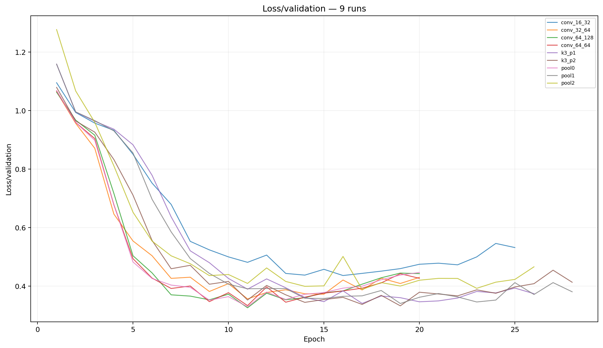
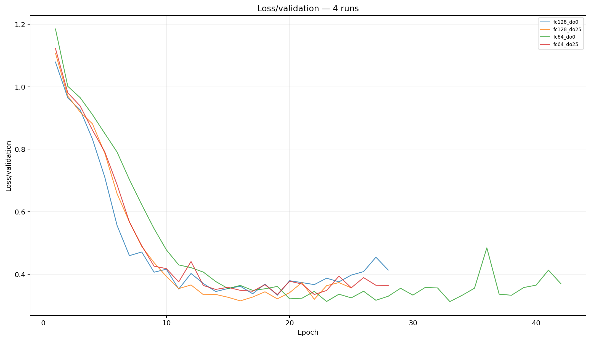
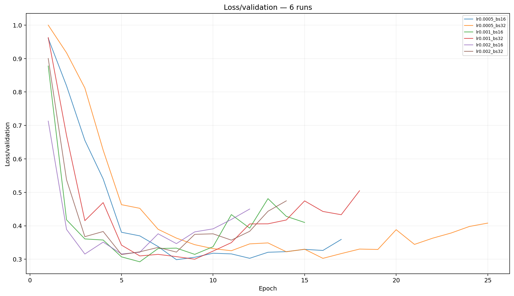
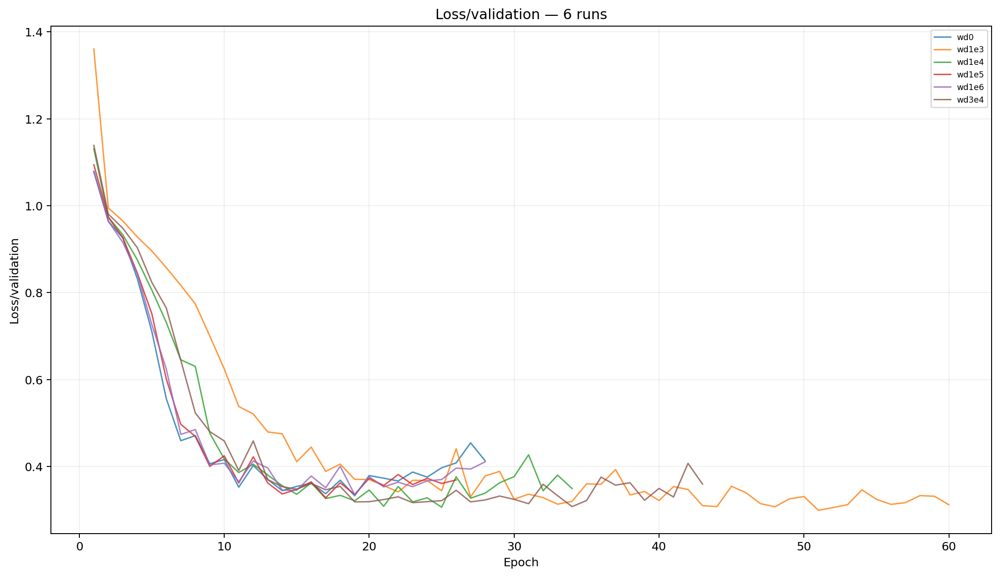
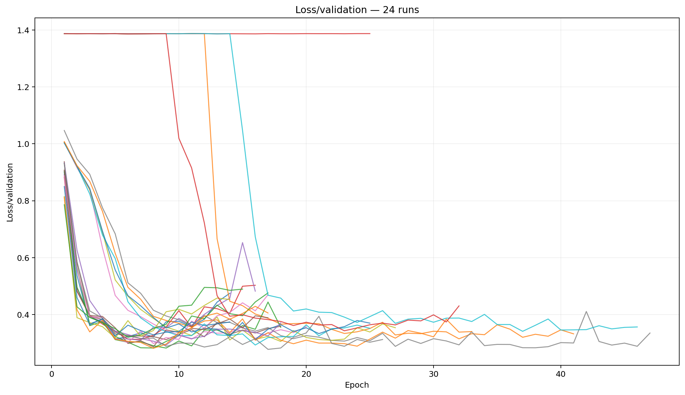
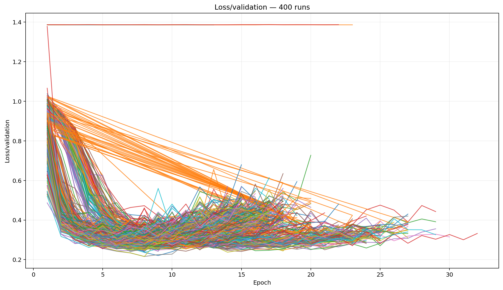
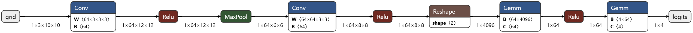

# GridWorld ML/RL Agent

A staged machine-learning project that starts with supervised imitation of a BFS expert policy, evaluates the resulting policies in closed loop, then moves from an MLP to a CNN before reinforcement learning.

The project is intentionally phase-driven: each phase freezes a contract, measures the resulting behavior, and uses the observed limitation to motivate the next phase rather than silently repairing it.

## Current status

- **P1 complete:** environment, reward contract, oracle policy, dataset generation, validation, and contract tests.
- **P2 complete:** supervised MLP baseline and experiment sweep.
- **P3 complete:** closed-loop MLP evaluation, rescue diagnostics, headless metrics, and minimal Pygame viewer.
- **P4 complete:** 3-channel CNN representation, architecture/head/optimization/weight-decay experiments, multi-seed finalist gauntlet, champion rollout evaluation, TensorBoard reporting, and ONNX export.
- **Next:** P5 DQN reinforcement learning.

---

## P1 — Environment and dataset contract

### World

- Grid size: `10 × 10`
- Obstacles: `30` cells
- State values:
  - `-1`: obstacle
  - `0`: empty
  - `1`: agent
  - `2`: goal
- Actions:
  - `0`: up
  - `1`: down
  - `2`: left
  - `3`: right
- Illegal moves and obstacle collisions leave the agent in place.
- Episodes terminate when the goal is reached or `max_steps` is exhausted.
- Generated maps must be solvable according to BFS.

### Reward contract

| Event | Reward |
|---|---:|
| Goal | `+10.0` |
| Timeout | `-5.0` |
| Boundary or obstacle hit | `-2.0` |
| Legal move closer to goal | `-0.5` |
| Legal move farther or equal | `-1.5` |

Goal completion takes precedence when the goal is reached on the final permitted step.

### Canonical dataset

- Dataset version: `gridworld_dataset_v1`
- Environment version: `gridworld_env_v1`
- Reward version: `manhattan_shaped_v1`
- Episodes: `2000`
- Maximum steps: `200`
- Seed: `123`
- Samples: `16679`
- Solved episodes: `2000`

Generated datasets are excluded from Git and can be reproduced from source.

---

## P2 — Supervised MLP baseline

P2 trains an MLP to imitate the BFS expert policy from labelled GridWorld states.

### Method

- deterministic `80/10/10` train/validation/test split
- two-hidden-layer MLP with ReLU activations
- cross-entropy classification loss
- Adam optimizer
- validation-loss checkpoint selection
- early stopping
- fixed split and experiment seeds
- checkpoint reconstruction from saved configuration

### Selected MLP

| Parameter | Value |
|---|---:|
| Hidden layers | `256, 128` |
| Batch size | `16` |
| Learning rate | `3e-4` |
| Dropout | `0.10` |
| Weight decay | `0.0` |

| Metric | Result |
|---|---:|
| Best epoch | `8` |
| Validation loss | `1.1248` |
| Validation accuracy | `47.03%` |
| Test loss | `1.1486` |
| Test accuracy | `45.12%` |
| Majority-class baseline | `26.12%` |

The MLP learns useful state-to-action structure, but classification accuracy alone does not answer whether the learned policy can navigate full episodes. P3 therefore evaluates the frozen model in closed loop.

---

## P3 — Closed-loop MLP evaluation

P3 places frozen P2 checkpoints back inside the environment.

The assisted evaluator compares the model action with the BFS oracle. When they agree, the model action is executed. When they disagree, the raw action is rejected and a random legal alternative is selected. The oracle acts only as a disagreement gate; it does not directly choose the rescue action.

This intentionally simple rescue mechanism prevents some deterministic softlocks without adding planning, memory, heuristics, or retraining.

### P3 closed-loop comparison

| Rollout metric | **MLP 256×128**<br>`bs16 · lr3e-4 · dropout 0.10` | **MLP 64×64**<br>`bs32 · lr3e-4 · dropout 0.10` |
|---|---:|---:|
| Episodes | 50 | 50 |
| Assisted success | **80%** | 76% |
| Fully autonomous success | **4%** | 2% |
| Timeout | 20% | 24% |
| Oracle agreement | **23.0%** | 21.0% |
| Random rescue rate | 77.0% | 79.0% |
| Avg. successful steps | **22.1** | 23.4 |

The main result is not the assisted success rate. The selected MLP solves only `2/50` episodes without rescue. Its own decisions push it into narrow state regions where deterministic errors repeat and compound.

### P3 conclusion

The supervised MLP is above baseline offline, but weak as an autonomous policy. P4 tests whether a spatial representation and convolutional inductive bias improve both classification and closed-loop behavior.

---

## P4 — Spatial CNN policy

### 3-channel representation

Instead of flattening the raw grid directly, P4 represents each state as three binary spatial channels:

```text
channel 0: obstacles
channel 1: agent
channel 2: goal
```

The conversion is:

```text
[N, 100] → [N, 3, 10, 10]
```

This was the strongest representation tested in P4 and produced the first large jump over the MLP baseline.

### Experiment progression

P4 separated the search into explicit stages:

```text
representation
→ architecture
→ head
→ optimization
→ finalist weight decay
→ multi-seed gauntlet
```

The figures below are regenerated from TensorBoard event files through `utils.export_tensorboard`; they are not screenshots of the TensorBoard UI.

### Representation baseline

The first CNN comparison tested the original single-channel grid against the 3-channel obstacle/agent/goal representation. The separation in validation loss justified freezing the 3-channel representation before architecture search.


### Architecture search

The architecture sweep tested convolution widths, pooling choices, and kernel/padding behavior. Wider feature extractors clearly improved over the early `16 → 32` baseline, with the later experiments converging on a `64 → 64` backbone, `3 × 3` kernels, padding `2`, and one pooling stage.



### Classifier-head search

With the spatial backbone frozen, P4 compared fully connected width and dropout. These runs clustered much more tightly than the representation and architecture experiments, showing that the largest P4 gain came from spatial encoding and convolutional feature extraction rather than simply increasing classifier capacity.



### Optimization search

Learning rate and batch size were then varied while keeping the selected representation and architecture fixed.



### Weight decay

A lightweight weight-decay sweep was used to inspect regularization behavior:



The historical finalist weight-decay stage then crossed the four finalist recipes with six weight-decay values:

```text
4 finalists × 6 weight decays = 24 runs
```



---

## P4 finalist gauntlet

Four finalist recipes were evaluated across:

```text
10 dataset seeds
× 10 experiment seeds
× 4 finalists
= 400 training runs
```

The selection criterion was frozen before comparison:

> **Lowest mean validation loss across all 100 dataset/experiment seed combinations for each recipe.**

The raw 400-run validation-loss view is intentionally dense; it is included as evidence of the experiment scale and cross-seed instability. Final selection is based on the aggregate statistics below, not visual inspection of individual curves.



### Finalist aggregate results

| Rank | Recipe | Mean val loss | Std | Catastrophes ≥ 1.0 |
|---:|---|---:|---:|---:|
| **1** | `fc64_do0_lr2e3_bs16_wd1e5` | **0.286665** | **0.020325** | **0** |
| 2 | `fc128_do25_lr5e4_bs32_wd1e3` | 0.306044 | 0.249567 | 5 |
| 3 | `fc128_do0_lr2e3_bs32_wd1e4` | 0.318260 | 0.190076 | 3 |
| 4 | `fc64_do0_lr1e3_bs16_wd3e4` | 0.337958 | 0.289437 | 7 |

The ranking follows the frozen mean-validation-loss criterion. The key result is the champion's stability: it produced **zero catastrophic runs** across all 100 seed combinations.

A useful contrast emerged against the dropout finalist: that model often converged to very strong individual solutions, but rare catastrophic optimization failures damaged its aggregate robustness. The selected champion sacrifices some best-case performance for substantially stronger cross-seed reliability.

### P4 champion

```text
input channels   3
conv channels    64 → 64
kernel           3 × 3
padding          2
pooling stages   1
flattened size   4096
classifier       4096 → 64 → 4
activation       ReLU
dropout          0.0
learning rate    2e-3
batch size       16
weight decay     1e-5
```

Stable deployed checkpoint:

```text
artifacts/p4_cnn/champion/checkpoint.pt
```

The canonical deployed copy was selected from dataset seed `123`; experiment seed `123` achieved best validation loss `0.281193` at epoch `8`.

---

## Champion closed-loop evaluation

The champion was evaluated on the same 100 generated worlds in both assisted and autonomous modes using seed `999`.

| Metric | Assisted | Autonomous |
|---|---:|---:|
| Episodes | 100 | 100 |
| Success | **100%** | **70%** |
| Timeout | 0% | **30%** |
| Mean steps | 9.58 | 64.49* |
| Median steps | 7 | 8 |
| Mean oracle agreement | **87.71%** | 77.94% |
| Total random rescues | 207 | 0 |
| Zero-rescue / autonomous successes | 56 | 70 |
| Mean repeated states | 0.33 | 0.54 |
| Mean max-state visits | 1.66 | **36.32** |

`*` Autonomous mean steps includes the 30 failed episodes that each run to the 200-step timeout. Among the **70 successful autonomous episodes**, mean path length is approximately **6.41 steps** with median **5**.

### Failure mode

All 30 autonomous failures show repeated-state behavior:

- `24/30` failures contain two repeatedly visited states, consistent with short oscillations.
- `6/30` failures contain one repeatedly visited state, consistent with stationary deadlock.
- Failed episodes have very high maximum state-visit counts.

This is the important P4 boundary. When the CNN stays on a productive trajectory, navigation is usually short and clean. When a deterministic behavioral-cloning policy revisits a failure state, it tends to reproduce the same action and has no intrinsic recovery mechanism.

That limitation is preserved rather than patched in P4.

---

## ONNX deployment artifact

The frozen champion can be exported from PyTorch to ONNX and inspected independently of the Python model definition.

The exported graph makes the final inference contract explicit:

```text
[1, 3, 10, 10]
→ Conv 3→64
→ ReLU
→ MaxPool
→ Conv 64→64
→ ReLU
→ Reshape 4096
→ FC 4096→64
→ ReLU
→ FC 64→4
→ logits
```



The horizontal graph above was exported from the champion ONNX model and inspected with Netron.

---

## Why P5 is reinforcement learning

P4 substantially improves spatial generalization and closed-loop success, but the remaining failures expose a limitation of behavioral cloning rather than representation alone.

The supervised policy learns:

```text
state → expert action
```

but does not learn the long-term consequences of selecting an action and transitioning into another state.

P5 therefore moves to DQN so action values are learned from transition and reward consequences:

```text
(state, action, reward, next_state)
→ Q-values
```

The P4 deadlocks and oscillations become the behavioral baseline against which the RL policy will be evaluated.

---

## Reproducibility and reporting

P4 separates raw generated experiment artifacts from curated evidence.

Typical artifact structure:

```text
artifacts/p4_cnn/
├── <config-set>/
│   ├── models/<run>/checkpoint.pt
│   ├── tensorboard/<run>/events...
│   └── tensorboard_exports/
├── champion/
│   └── checkpoint.pt
├── reports/
└── story/
    ├── baseline_validation_loss.png
    ├── architecture_validation_loss.png
    ├── head_validation_loss.png
    ├── optimization_validation_loss.png
    ├── weight_decay_validation_loss.png
    ├── weight_decay_finalists_validation_loss.png
    ├── gauntlet_validation_loss.png
    └── champion_onnx_graph.png
```

The experiment figures committed under `story/` are generated from TensorBoard event files through `utils.export_tensorboard`. Raw event files, full exports, gauntlet checkpoints, and other large experiment artifacts remain local/ignored; only the compact evidence used by this README is intended for Git.

---

## Useful commands

Generate the canonical dataset:

```powershell
python -m scripts.generate_dataset --episodes 2000 --max_steps 200 --seed 123
```

Validate it:

```powershell
python -m scripts.verify data/raw/gridworld_2000ep_200ms_123seed.npz
```

Run P4 experiment stages:

```powershell
python -m training.train_cnn --config-set baseline
python -m training.train_cnn --config-set architecture
python -m training.train_cnn --config-set head
python -m training.train_cnn --config-set optimization
python -m training.train_cnn --config-set weight_decay
```

Historical finalist weight-decay sweep:

```powershell
python -m training.train_cnn --config-set weight_decay_finalists
```

Run champion assisted evaluation:

```powershell
python -m environment.evaluate --mode headless --checkpoint artifacts/p4_cnn/champion/checkpoint.pt --episodes 100 --seed 999
```

Run champion autonomous evaluation:

```powershell
python -m environment.evaluate --mode autonomous --checkpoint artifacts/p4_cnn/champion/checkpoint.pt --episodes 100 --seed 999
```

Run TensorBoard for a config set:

```powershell
tensorboard --logdir artifacts/p4_cnn/architecture/tensorboard --port 6008
```

Run tests and formatting checks:

```powershell
python -m pytest
python -m ruff check .
python -m ruff format --check .
```

---

## Roadmap

- [x] **P1:** environment and dataset contract
- [x] **P2:** supervised MLP baseline
- [x] **P3:** closed-loop evaluation and minimal Pygame viewer
- [x] **P4:** CNN representation, multi-seed selection, rollout evaluation, ONNX export
- [ ] **P5:** DQN reinforcement learning
- [ ] **P6:** supervised-to-RL transfer experiments
- [ ] **P7:** polished Pygame application and experiment dashboard
- [ ] **P8:** scaling and robustness

P4 closes with a policy that is dramatically stronger than the P2/P3 MLP but still exhibits deterministic deadlocks and short oscillations under autonomous rollout. Those failures are the starting benchmark for P5.
